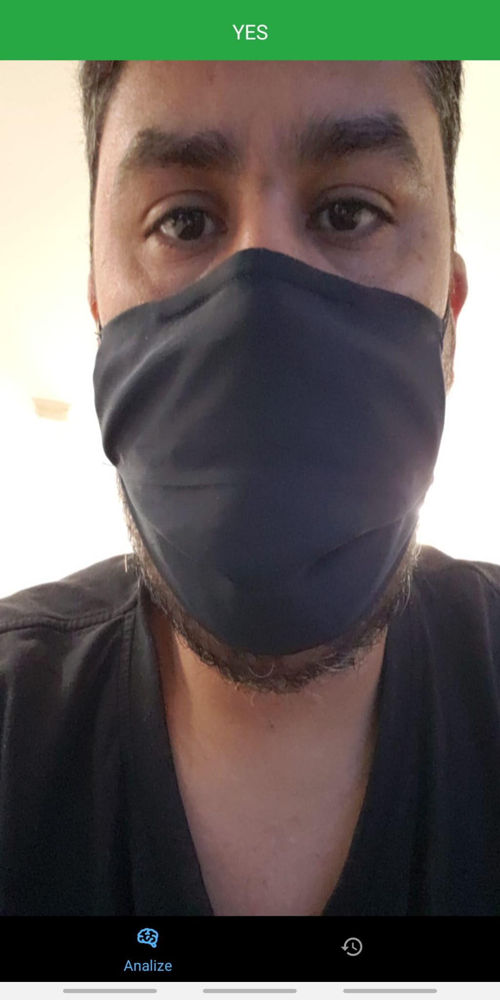

# Mask Detector

The app detects a mask using the front camera in real time.

Getting Started: 
<code>npm i</code>  
<code>npx react-native run-android</code> OR <code>npx react-native run-ios</code>

Remember to have a device connected. It doesn't work very well on emulators. Too demanding on resources.  

[Tensorflow JS documentation](https://js.tensorflow.org/api/latest/)

[Notebook](https://github.com/eleonne/maskdetector/blob/main/trained_models/facemask.ipynb)

[Dataset](https://www.kaggle.com/datasets/dhruvmak/face-mask-detection?resource=download)
